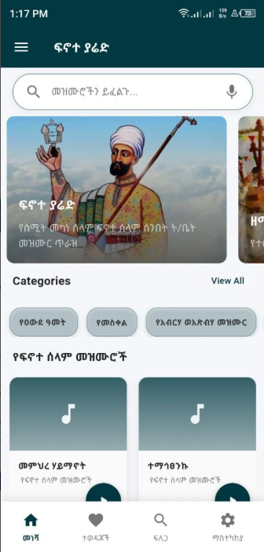
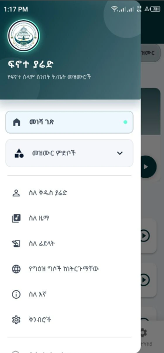
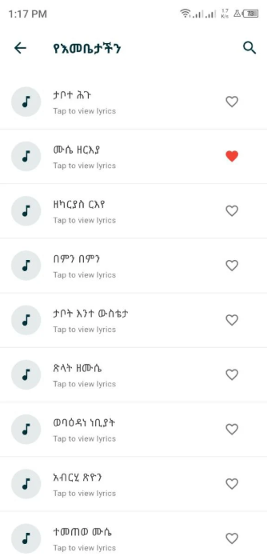
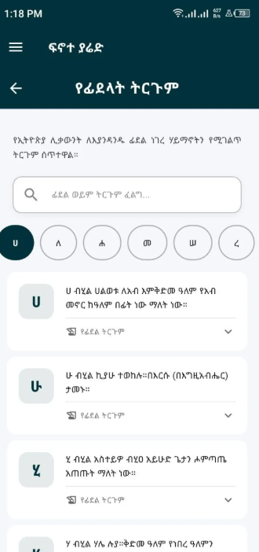
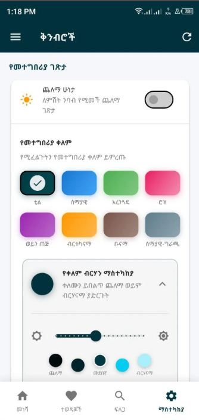

# Finote Yared

  

  A faith-centered Ethiopian Orthodox hymn app designed with product thinking, clean Flutter architecture, and a strong mobile user experience.

  <a href="https://play.google.com/store/apps/details?id=org.finot.zema_finot&pcampaignid=web_share"><strong>View on Google Play</strong></a>

## Product Overview

Finote Yared is a mobile application created to present Ethiopian Orthodox hymn content in a beautiful, accessible, and organized digital experience. It brings together spiritual music, searchable hymn content, saved favorites, and rich media inside a focused interface built for everyday mobile use.

The project reflects both product design thinking and practical engineering. It was built to make traditional spiritual content feel easier to access, easier to explore, and more engaging for modern users on mobile devices.

## Why This Project Matters

This repository is more than an app showcase. It demonstrates my ability to design, structure, and ship a real mobile product with attention to usability, local data handling, state management, performance-aware UI patterns, and deployment-ready delivery.

For teams and companies reviewing my work, Finote Yared represents the kind of end-to-end development I can contribute:

- Product-focused mobile application development
- Flutter UI engineering with structured screens and reusable components
- Local persistence and data-driven content rendering
- Mobile feature integration including audio and platform-specific capabilities
- User-centered thinking shaped around clarity, accessibility, and engagement

## Core User Experience

- Organized hymn browsing experience
- Search support for fast content discovery
- Favorites for saving meaningful selections
- Audio playback for a richer devotional experience
- Theme and settings support for personalized use
- Admin-oriented content management flows

## Technical Highlights

Finote Yared was built with Flutter and structured across screens, services, providers, models, widgets, and local data layers. The project includes a combination of UI engineering, persistence, and feature integration that reflects practical app development work.

- **Flutter + Dart** for cross-platform mobile development
- **Provider** for app state and settings management
- **SQLite (`sqflite`)** for persistent local data storage
- **Shared Preferences** for lightweight user settings and session behavior
- **Audio integration** using `audioplayers`
- **Caching and media handling** with image and asset support
- **Platform-aware setup** including Android and iOS project structure
- **Custom theming** and adjustable presentation logic
- **Voice-related service integration** prepared through platform channels

## Engineering Focus

This project highlights several areas of software development that matter in production mobile work:

- Designing maintainable application structure instead of placing everything in a single file
- Separating UI concerns from data, services, and settings logic
- Building features around real user behavior such as search, playback, saved items, and content exploration
- Handling local-first experiences with structured storage and retrieval
- Combining visual polish with practical functionality
- Delivering a publishable application already released to the Play Store

## Google Play

Finote Yared is published on Google Play:

[https://play.google.com/store/apps/details?id=org.finot.zema_finot&pcampaignid=web_share](https://play.google.com/store/apps/details?id=org.finot.zema_finot&pcampaignid=web_share)

## Screenshots

  
  
  

  
  

## Vision

Finote Yared exists to preserve, present, and celebrate Ethiopian Orthodox spiritual expression through a digital product that feels respectful, welcoming, and purposeful. It is intended to help users stay connected to hymn tradition through reading, listening, and daily engagement.

## Developer

Developed by **Nathanel Wondwosen**.

I am a software developer focused on building useful, user-centered digital products with strong attention to interface quality, structure, and real-world delivery.

## Copyright

Copyright (c) 2025 Zema Finot. All rights reserved.
